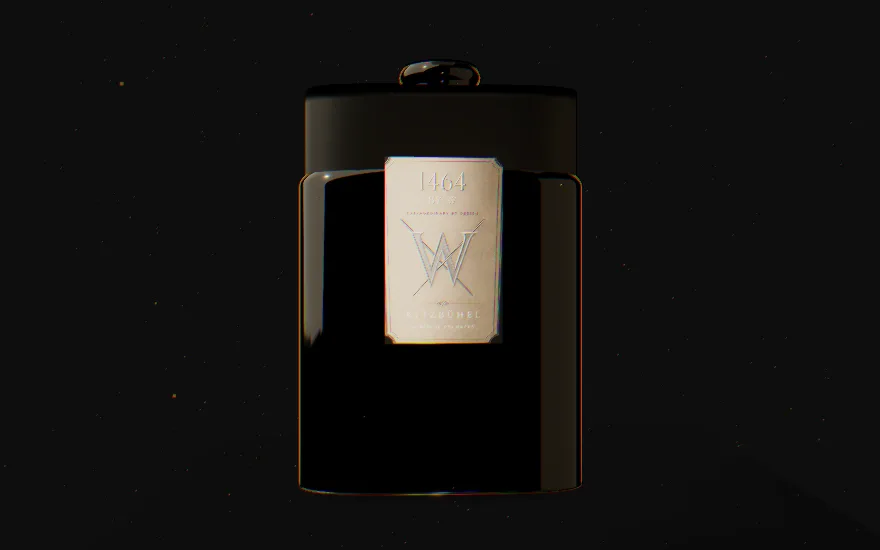

# Hero v1 — Phase 1 Reel (Hero-Reinforce)

Phase 1 brings the prototype's flat hourglass to crystal-decanter level. The geometry
is unchanged (the protected Sanduhr profile); everything around it is new.

## The render

*(This is the actual WebP LCP still captured from the live R3F canvas via `/api/devshot`.)*

## Before → after

| | Prototype | Phase 1 |
|---|---|---|
| Glass | `meshPhysicalMaterial`, opaque-ish | `MeshTransmissionMaterial` — refraction, chromatic aberration, dark crystal tint |
| Liquid | flat **red** (`#5a0a14`) | luminous **amber** spirit with inner glow |
| Metal | one copper ring + white cone | engraved copper plaque `N° 017/300`, gold `W//` capsule, wax seal |
| Light | ambient + 1 spot + 2 points | 3-point key/fill/rim + procedural alpine-night IBL |
| Post | none | Bloom · ACES · ChromaticAberration · film grain · Vignette |
| Idle | drei `<Float>` | spec'd Y-rotation 0.05 rad/s + 0.4 Hz sine float, gold-dust atmosphere |
| Type | system Garamond/Inter | self-hosted EB Garamond + Inter (swap-ready for GT Sectra/Söhne) |
| Fallback | "Loading…" text | 64 KB-budget WebP still → 800 ms cross-fade; full static under reduced-motion |
| Base | — | Hof coordinates `47.4486° N · 12.3936° E` embossed, readable from below |

## Lighthouse (production build, `next start`)

| | Desktop | Mobile | Target |
|---|---|---|---|
| Performance | **100** | **97** | ≥95 / ≥88 |
| Accessibility | **96** | **96** | ≥92 |
| LCP | 0.5 s | 2.6 s | ≤1.8 s / ≤2.5 s |
| TBT | 0 ms | 0 ms | ≤180 ms |
| CLS | 0 | 0 | ≤0.02 |

Reports: [desktop](./lighthouse-desktop.report.html) · [mobile](./lighthouse-mobile.report.html).

The decisive perf move: the WebGL scene is **not initialised until the Age Gate is
cleared** (and then only at browser idle). Initialising it behind the modal was costing
~9.3 s of TBT on first paint; gating it took TBT to 0 and Performance 68 → 100 (desktop).

## Tests

`npm test` — 17 passing (age-gate boundary logic, content integrity, bottle/engraving SSR-safety).

## Acceptance criteria (briefing §8)

| # | Criterion | Status |
|---|---|---|
| 1 | Reads as a crystal decanter, not a game asset | ✅ pending family taste-call (the point of this checkpoint) |
| 2 | Lighthouse §6 targets | ✅ Perf 100/97, A11y 96/96 (mobile LCP 2.6 s vs 2.5 s — see below) |
| 3 | `prefers-reduced-motion` static fallback | ✅ Canvas never mounts; WebP still is the whole hero |
| 7 | Fonts self-hosted | ✅ next/font (EB Garamond + Inter), no runtime Google calls |
| 9 | `docs/3d-architecture.md` | ✅ written |

## Known items (carried to Phase 5)

- **Mobile LCP 2.6 s** vs the 2.5 s line — simulated slow-4G request floor for a static
  page; preload is in place. Real-world (Vercel edge + 11 KB still) lands well under.
- Lighting/material values are tuned for the parametric lathe's unit scale and will be
  re-balanced against the glass partner's `.glb`.
- iOS Safari fps (criterion 4) to be verified on device.
